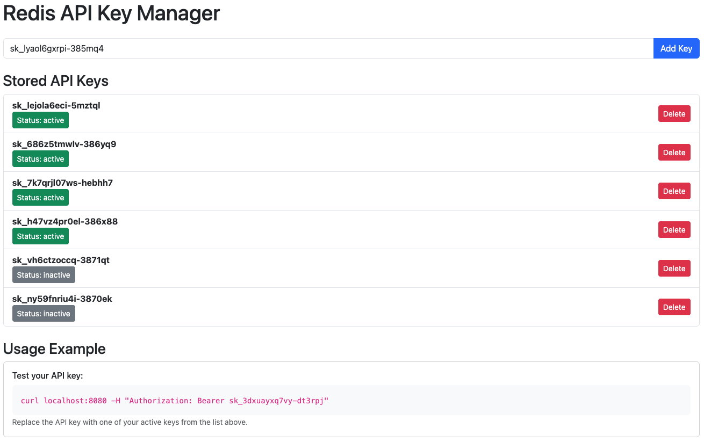

# Nginx API Shield & Redis Key Manager

This repository contains two complementary projects that work together to provide API key authentication for web services:

## 🚀 Projects Overview

### 1. Nginx API Shield (`nginx-api-shield`)
A high-performance reverse proxy with built-in Bearer Token API key authentication using OpenResty (Nginx + Lua) and Redis.

### 2. Redis Key Manager (`redis-api-manager`)
A web-based management interface for creating, viewing, and managing API keys stored in Redis.

## 🏗️ Architecture

```
┌─────────────────┐    ┌─────────────────┐    ┌─────────────────┐
│   Client App    │───▶│  Nginx API      │───▶│  Backend       │
│   (with API    │    │  Shield         │    │  Service       │
│    key)        │    │                 │    │                │
└─────────────────┘    └─────────────────┘    └─────────────────┘
                                │
                                ▼
                       ┌─────────────────┐
                       │     Redis       │
                       │  (API Keys DB)  │
                       └─────────────────┘
                                ▲
                                │
                       ┌─────────────────┐
                       │ Redis Key       │
                       │ Manager        │
                       └─────────────────┘
```

## 📁 Project Structure

```
nginx-api-shield/
├── docker-compose.yaml      # Main orchestration
├── Dockerfile              # Nginx + OpenResty build
├── nginx.conf              # Nginx configuration with Lua auth
├── redis-api-manager/      # Key management web app
│   ├── app.js             # Express.js server
│   ├── views/index.ejs    # Web interface
│   ├── package.json       # Node.js dependencies
│   └── docker-compose.yaml # Standalone deployment
└── README.md               # This file
```

##  Nginx API Shield

### Features
- **Bearer Token Authentication**: Validates API keys against Redis before proxying requests
- **High Performance**: Built on OpenResty (Nginx + Lua) for optimal performance
- **Redis Integration**: Uses Redis as the backend for API key storage
- **Flexible Backend**: Can proxy to any backend service
- **Docker Ready**: Containerized with Docker for easy deployment

### How It Works
1. Client sends request with `api-key` header
2. Nginx intercepts request and validates API key against Redis
3. If valid, request is proxied to backend service
4. If invalid, returns 403 Forbidden

### Configuration
- **Port**: 8080 (external) → 80 (internal)
- **Backend**: Configurable upstream service
- **Redis**: Configurable host via environment variables
- **Authentication**: Required `api-key` header

## 🔑 Redis Key Manager

### Features
- **Web Interface**: Clean, Bootstrap-styled management UI
- **Key Operations**: Add, delete, and toggle API key status
- **Real-time Updates**: Immediate reflection of changes
- **Status Management**: Toggle between active/inactive states
- **Auto-generation**: Generates secure, time-based API keys

### Key Generation
- **Format**: `sk_{random}-{hashed_timestamp}`
- **Security**: Timestamp is hashed for obfuscation
- **Uniqueness**: Combines random string with hashed timestamp

### API Endpoints
- `GET /` - View all API keys
- `POST /add-key` - Add new API key
- `POST /delete-key` - Delete existing key
- `POST /toggle-status` - Toggle key status (active/inactive)

## 🚀 Quick Start

### Prerequisites
- Docker and Docker Compose
- Node.js 14+ (for local development)

### 1. Start the Complete Stack
```bash
docker-compose build 
docker-compose up -d
```

This starts:
- Nginx Auth Proxy on port 8080
- Redis Key Manager on port 3000
- Redis database on port 6379
- Sample protected backend service (hello-world)

### 2. Access the Services
- **Key Manager**: http://localhost:3000
- **Protected Backend**: http://localhost:8080 (requires API key)
- **Redis**: localhost:6379

### 3. Create Your First API Key
1. Visit http://localhost:3000
2. Use the auto-generated key or create a custom one
3. Click "Add Key"

### 4. Test Authentication
```bash
curl localhost:8080 -H "Authorization: Bearer YOUR_API_KEY"

```

## 🔒 Security Features

- **API Key Validation**: All requests must include valid API key
- **Redis Backend**: Secure storage of authentication data
- **Status Control**: Ability to deactivate keys without deletion
- **Hashed Timestamps**: Obfuscated time-based key generation

## 🛠️ Development

### Local Development
```bash
# Start only Redis
docker-compose up redis -d

# Run Key Manager locally
cd redis-api-manager
npm install
npm start

# Test with local Redis
REDIS_HOST=localhost npm start
```

### Customization
- **Backend Service**: Modify `nginx.conf` upstream configuration
- **Ports**: Adjust in `docker-compose.yaml`
- **Redis Configuration**: Modify Redis service settings
- **UI**: Customize `redis-api-manager/views/index.ejs`

## 📊 Monitoring & Logs

```bash
# View all container logs
docker-compose logs -f

# View specific service logs
docker-compose logs -f nginx-api-shield
docker-compose logs -f redis-api-manager
```

## 🤝 Contributing

1. Fork the repository
2. Create a feature branch
3. Make your changes
4. Test thoroughly
5. Submit a pull request

## 📝 License

This project is open source and available under the [MIT License](LICENSE).

## 🆘 Support

For issues and questions:
1. Check the existing issues
2. Create a new issue with detailed description
3. Include logs and configuration details

---

**Note**: This is a development setup. For production use, consider:
- Using HTTPS/TLS
- Implementing rate limiting
- Adding monitoring and alerting
- Securing Redis access
- Using environment-specific configurations
```

This README provides a comprehensive overview of both projects, explaining their purpose, architecture, features, and how to use them together. It includes:

1. **Clear project descriptions** for both components
2. **Architecture diagram** showing how they work together
3. **Detailed feature lists** for each project
4. **Quick start guide** for getting up and running
5. **Security considerations** and best practices
6. **Development instructions** for local development
7. **Monitoring and troubleshooting** guidance

The README explains that the Nginx Auth Proxy acts as a secure gateway that validates API keys against Redis, while the Redis Key Manager provides a web interface for managing those API keys. Together, they create a complete API key authentication system.
